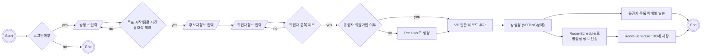
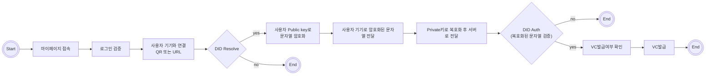
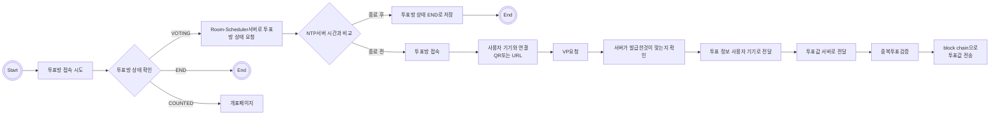
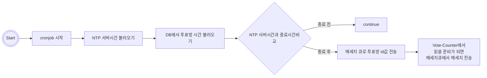
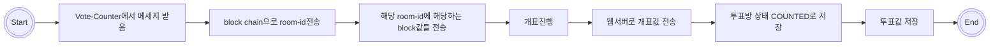

# 🗳️ DIDI블록
## DID와 블록체인을 이용한 온라인 투표 시스템 

### 👥 팀원
---
👤 **박미라**: 팀장, 프로젝트 총괄 
 🔗 박미라 깃허브 <https://github.com/miracle-mira>

👤 **장정환**: 웹, 투표시스템, DID, VC, VP 발급 및 블록체인 구축 
 🔗 장정환 깃허브 <https://github.com/jjhwan-h>

👤 **하지민**: SSI앱 개발 
 🔗 하지민 깃허브 <https://github.com/hajimin1>

### 👩🏻‍🏫 프로젝트 소개
---
 오늘날 인터넷만 연결되면 모든 지 할 수 있는 시대를 도래했다고 과언이 아닐 정도로 우리는 인터넷만 연결되면 많은 일들을 할 수 있다. 하지만 아직 인터넷으로는 한계가 있는 또는 아직 대중화되지 않은 것이 하나있다. 그것은 투표이다. 우리는 아직 투표를 떠올리면 종이 투표를 생각한다. 투표를 온라인으로 하기에는 아직 보안성과 신뢰성 그리고 투명성에서 거부감이 드는 것이 사실이다. 그렇다면 현재 진행하는 종이 투표는 안전할까? 알다시피 종이 투표도 그 한계가 있다. 다음은 두 가지 투표 사례이다.
 대표적인 투표 조작으로는 프로듀스 101 투표 조작이 있다. 프로듀스 101이란 국민이 직접 연습생들을 뽑아 아이돌을 만든다는 취지의 프로그램이다. 이처럼 투표가 중요한 프로그램에서 투표를 조작했다는 의혹이 터졌고, 결국 관계자들은 구속됐다. 이는 온라인 투표의 가장 우려되는 부분, 특정인이 투표 결과를 임의 조작할 수 있다는 것을 여과 없이 보여준다. 2024년에는 중요한 투표인 총선이 있다. 하지만 다음 [표1-1]를 보면 알다시피 총선과 대통령 선거같이 중요한 투표에서 20-30대의 투표율이 다른 연령층에 비해 투표율이 저조하다. 어쩔 수 없는 종이 투표의 한계를 보여주며 이 또한 투표 조작의 위험성을 배제할 수 없다. 
 
따라서 우리는 새로운 투표 방법에 대해 생각해 보아야 한다. 투표의 투명성과 선거 4원칙을 지키면서 투표 참여율 증가를 보장할 수 있는 투표 방법이 필요하다. 이에 우리가 생각한 것이 블록체인과 DID를 활용한 온라인 투표이다. 블록체인을 통해 투명성을 보장하고, DID를 사용해 선거 4원칙을 보장하고, 그리고 온라인 투표를 통해 참여율을 증가시킬 수 있기 때문이다.

### ⏱️ 개발 기간
---
- **2023.09~2023.12 프로젝트 기획** 
- **2024.03~ 개발**

  
### ◼️ 개발 환경
---
**node.js v18.19.0** 
**go v1.22** 
**mysql v8.3.0** 
**postgres v13** 
**aries-framework v0.4.2** 
**hyperledger v0.1.3** 
**Test Indy Network** 

### ◼️ 주요 기능
---
|기능|설명|
|------|---|
|회원가입| 1. 사용자 기기에서 DID발급한다.  2. 이메일/비밀번호/이름/DID 입력한다.   3. 이메일 인증한다.  
|방생성|1. 방정보입력(방이름, 투표시작 시간, 투표종료 시간, 설명)한다.  2. 후보자 정보 입력(이름, 나이 , 성별, 공약)한다. 3. 유권자 정보 입력(아이디, 이메일)한다.  4. 회원가입 되지 않은 유권자는 preUser로 등록한다.  5. 유권자의 VC발급여부를 확인하는 레코드생성한다.  6. 중복된 유권자 확인한다.  7. 유권자 이메일로 유권자 등록메일 발송한다.  8. Room-Scheduler로 room-id, 투표종료 시간 전송한다.  9. Room-Scheduler의 DB에 저장한다. 
|투표권(VC)발급|1. 마이페이지에서 발급가능한 VC확인한다. 2. 발급버튼을 누르면 [로그인 검증] 3. [DID Auth] 4.[VC 중복 발급 확인] 5.VC발급확인 
|투표|1.투표방에 접속한다. 2.QR코드, URL를 사용자기기에 입력하여 서버와 연결한다. 3.로그인검증한다. 4.VC발급 주체 검증한다. 5.중복투표 검증한다. 6.사용자는 원하는 항목에 투표한다. 7.block chain으로 투표값 전송한다.
|개표방법|1. 투표방 생성 시 투표종료 시간을 스케줄러 서버로 전송한다.  2. 스케줄러 서버는 투표 종료시간을 데이터베이스에 저장한다.  3. 스케줄러 서버는 주기적으로(30분) 데이터베이스에 저장된 투표종료시간을 점검한다.  4. 투표 종료시간이 넘은 투표방은 메세지큐를 통해 개표서버로 전달한다.  5. 개표서버는 블록체인에 있는 해당 투표방 정보를 가져와 개표 후 웹서버로 전달한다. 

### ◼️ 프로젝트 아키텍쳐

### ◼️ 시스템 흐름도
**방생성**

**투표권(VC)발급**

**투표**

**투표 종료확인**

**개표**

### ◼️ 참고 및 출처
**Credo-ts** 
https://github.com/openwallet-foundation/credo-ts 
**hyperledger/aries-askar** 
https://github.com/hyperledger/aries-askar 
**nomadcoders/nomadcoin** 
https://github.com/nomadcoders/nomadcoin 
### ◼️ 영상 및 사진
데모영상: https://drive.google.com/drive/folders/1ydreaF1cjDFiHgTD4mFt3JJdlTPqJVqw?usp=sharing

